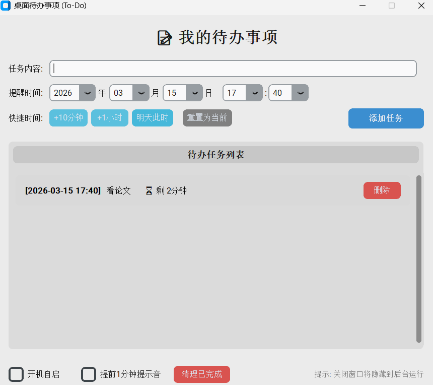

# 📝 MyTodoApp

MyTodoApp 是一款基于 **Python** 与 **CustomTkinter** 构建的现代化 Windows 桌面待办事项管理工具。它融合了极简主义设计与高效的交互逻辑，支持精准的定时提醒、静默后台运行及开机自启，旨在为您提供流畅、无打扰的任务管理体验。




## ✨ 核心特性

### 🎨 现代化 UI 设计
- **沉浸式视觉**：采用圆角设计语言，原生支持 Windows 深色/浅色模式切换，界面精致美观。
- **动态交互**：列表实时渲染剩余倒计时（如 `⏳ 剩 2小时30分`），临近任务自动高亮预警。
- **智能排序**：内置任务权重算法，自动按紧急程度排序，确保重要事项始终置顶。

### ⚡ 高效操作体验
- **精准时间流**：提供年/月/日/时/分全维度下拉选择，启动时自动同步系统时间。
- **快捷指令**：内置 `+10分钟`、`+1小时`、`明天此时` 快捷按钮，一键完成设置。
- **极速录入**：支持 `<Enter>` 键快速提交，让记录任务成为一种肌肉记忆。

### 🔔 多维提醒机制
- **听觉预警**：任务到期前 1 分钟播放轻柔提示音，提前唤醒注意力。
- **视觉阻断**：时间到达时，在屏幕中央弹出置顶窗口，确保在全屏应用下也能有效触达。
- **弹性推迟**：支持“推迟 10 分钟”功能，灵活应对突发状况。

### 🛡️ 系统级集成
- **静默守护**：关闭主窗口自动折叠至系统托盘，双击图标即可瞬间唤醒。
- **无感自启**：支持开机静默启动（Minimzed Mode），直接驻留后台，不干扰启动流程。
- **稳健运行**：内置单例互斥锁（Mutex），防止多开冲突；数据实时本地持久化存储。

## 🚀 快速开始

### 环境依赖
- Windows 10/11
- Python 3.8+

### 安装步骤

1.  **获取源码**
    ```bash
    git clone https://github.com/Re-ljk/MyTodoApp.git
    cd MyTodoApp
    ```

2.  **安装依赖**
    ```bash
    pip install -r requirements.txt
    ```

3.  **启动应用**
    - **开发者模式**:
      ```bash
      python todo_app.py
      ```
    - **用户模式 (推荐)**:
      直接双击 `start.vbs` 即可无黑框启动。

## 📂 项目结构

```text
MyTodoApp/
├── todo_app.py         # 核心应用逻辑与 UI 渲染
├── requirements.txt    # 项目依赖清单
├── start.vbs           # 无控制台引导脚本
├── todos.json          # 任务数据持久化文件
└── todo_app.log        # 运行状态日志
```

